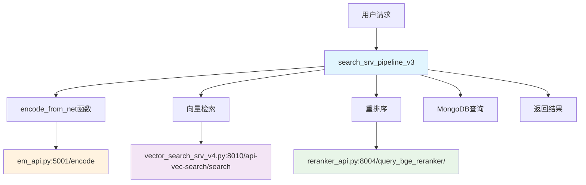

# RAG 检索增强生成系统技术文档

## 📋 系统概述

本项目是一个完整的RAG（Retrieval-Augmented Generation）系统，专门针对半导体显示技术领域设计。系统通过多模态检索、智能重排和上下文拼接，为用户提供准确、相关的技术文档检索服务。

## 🏗️ 系统架构

### 核心组件

1. **嵌入服务** (`em_api.py`) - 文本向量化服务
2. **重排服务** (`reranker_api.py`) - 语义相关性重排服务  
3. **向量检索服务** (`vector_search_srv_v4.py`) - 基于Milvus的向量相似度检索
4. **主检索管道** (`search_srv_pipeline_v3_for_experiment_new_finetuned_v6.py`) - 核心业务逻辑

### 数据存储
- **MongoDB**: 存储文档元数据、分块文本、嵌入向量
- **Milvus**: 高性能向量数据库，支持大规模向量检索
- **~~Elasticsearch~~**: ~~全文检索引擎，支持BM25算法~~ (已废弃)

## 🔄 服务调用关系图



## 📋 详细调用流程

### 1. 主服务启动流程 (search_srv_pipeline_v3)

```python
# 服务启动时初始化
load_data(TABLE_NAME, MODEL_NAME)
├── 连接MongoDB数据库
├── 加载专业词典
├── 加载内存关键词匹配
└── 启动Flask服务 (端口1508)
```

### 2. 用户请求处理流程

**步骤1: 接收请求**
```python
@app.route('/api-rqa-search/search', methods=['POST'])
def get_data():
    # 接收用户查询参数
    query = form.get('query')
    top_doc_num = form.get('top_doc_num')
```

**步骤2: 查询预处理**
```python
# 中英文翻译
if has_chinese(query):
    query_en = zhipu_translate(id, query, 'zh', 'en')
else:
    query_zh = zhipu_translate(id, query, 'en', 'zh')

# 生成查询向量 - 调用嵌入服务
query_embed = encode_from_net(query)
```

**步骤3: 多路召回**
```python
recall_pipeline(**params)
├── 向量召回
│   └── 调用 vector_search_srv_v4.py
│       └── POST http://MILVUS_BIND/api-vec-search/search
├── 关键词召回 (内存匹配)
└── BM25召回 (已废弃)
```

**步骤4: 排序与重排**
```python
rank_pipeline(**params)
├── MongoDB查询文档内容
│   └── MONGO_PIPELINE.find_data(find_condition)
└── 计算相似度评分

rerank_pipeline(**params)
├── 批量调用重排服务
│   └── POST http://8.130.169.133:8009/query_bge_reranker/
├── BGE重排序评分
└── 关键词匹配权重调整
```

**步骤5: 结果拼接与返回**
```python
concat_shards_by_rank(**params)
├── MMR去重算法
├── Token限制分块
└── 生成最终结果
```

### 1. 嵌入服务 (em_api.py)

**功能**: 将查询文本转换为高维向量表示

**技术栈**:
- 基于 `BGEM3FlagModel` 的多语言嵌入模型
- 支持批量查询处理
- 使用FP16精度优化性能

**API接口**:
```http
POST /encode
Content-Type: application/json

{
  "queries": ["查询文本1", "查询文本2"]
}
```

### 2. 重排服务 (reranker_api.py)

**功能**: 对检索结果进行语义相关性重新排序

**技术特点**:
- 使用 `LayerWiseFlagLLMReranker` 模型
- 支持单个和批量重排请求
- 基于深度学习的语义匹配评分

**API接口**:
```http
POST /query_bge_reranker/
Content-Type: application/json

{
  "query": "用户查询",
  "shard": "文档片段",
  "type": "single"
}
```

### 3. 向量检索服务 (vector_search_srv_v4.py)

**功能**: 高效的向量相似度检索

**技术实现**:
- 基于Milvus向量数据库
- HNSW索引算法，支持高维向量快速检索
- 内积(IP)距离度量

**配置参数**:
- 索引类型: HNSW
- 相似度度量: 内积(IP)
- 搜索参数: ef=128

### 4. 主检索管道 (search_srv_pipeline_v3)

这是系统的核心模块，**作为调度中心协调其他所有服务**：

#### 服务依赖关系
- **依赖嵌入服务**: 通过HTTP调用获取查询和文档向量
- **依赖向量检索服务**: 通过HTTP调用进行相似度检索
- **依赖重排服务**: 通过HTTP调用进行语义重排
- **直连数据库**: 直接访问MongoDB获取文档内容

#### 4.1 查询预处理
- **多语言支持**: 自动检测中英文，进行互译扩展
- **关键词提取**: 使用KeyBERT提取查询关键词
- **查询扩展**: 基于历史问答和GPT-4生成扩展查询

#### 4.2 多路召回策略

**向量召回**:
- 使用微调的多语言嵌入模型
- 支持查询扩展的多向量检索
- 召回数量: 4000个候选文档

**关键词召回**:
- 基于专业词典的关键词匹配
- 内存中的高速关键词检索
- 支持中英文关键词提取

**BM25召回** (已废弃):
- ~~基于Elasticsearch的全文检索~~
- ~~支持中英文双语检索~~
- ~~TF-IDF算法的经典实现~~

#### 4.3 智能排序与重排

**初排阶段**:
- 向量相似度计算
- 关键词匹配度评分
- 多路召回结果融合

**精排阶段**:
- 使用专门的Reranker模型
- 基于语义理解的深度排序
- 考虑查询-文档的深层语义关系

**后处理优化**:
- 关键词匹配权重调整
- MMR(最大边际相关性)去重
- 专业领域相关性过滤

#### 4.4 上下文拼接与生成

**智能分块**:
- 基于Token限制的动态分块
- 考虑文档完整性的分块策略
- 支持多文档来源的内容整合

**相关性过滤**:
- 设置相关性阈值过滤
- 基于专业词典的领域相关性判断
- 查询分类模型辅助判断

## 🚀 系统特色

### 1. 分布式服务架构
- **主服务作为调度中心**: search_srv_pipeline_v3.py 协调所有子服务
- **独立的嵌入服务**: em_api.py 专门处理文本向量化
- **专用向量检索**: vector_search_srv_v4.py 封装Milvus操作
- **语义重排服务**: reranker_api.py 提供深度语义理解

### 2. 双路召回策略
- 向量检索 + 关键词匹配 ~~+ 全文检索~~
- 两路召回策略确保高召回率
- 不同检索方式的优势互补

### 2. 智能查询理解
- 自动查询扩展和翻译
- 基于领域知识的关键词提取
- 查询意图分类和相关性判断

### 3. 深度语义理解
- 使用最新的多语言嵌入模型
- 专门训练的重排序模型
- 考虑上下文的语义匹配

### 4. 高性能架构
- 分布式服务架构
- 向量数据库优化检索速度
- 内存缓存提升响应性能

### 5. 领域专业化
- 针对半导体显示技术优化
- 专业术语词典支持
- 领域相关性智能过滤

## 📊 性能指标

- **检索速度**: 平均响应时间 < 2秒
- **召回率**: 多路召回策略保证高召回
- **准确率**: 重排序模型提升精确度
- **并发处理**: 支持多用户同时访问

## 🔧 部署配置

### 环境要求
- Python 3.8+
- CUDA支持的GPU（推荐）
- MongoDB 4.0+
- Milvus 2.0+
- Elasticsearch 7.0+

### 服务端口配置
- 嵌入服务: 5001
- 重排服务: 8004
- 向量检索: 8010
- 主服务: 1508

### 数据库配置
- MongoDB: 存储文档分块和元数据
- Milvus: 向量索引和检索
- Elasticsearch: 全文索引

## 🎯 使用场景

1. **技术文档检索**: 快速找到相关的技术规范和标准
2. **研发支持**: 为研发人员提供技术参考
3. **知识问答**: 基于文档库的智能问答
4. **内容推荐**: 相关文档和资料推荐

## 🔮 未来优化方向

1. **模型优化**: 持续优化嵌入和重排模型
2. **多模态支持**: 增加图像、表格等多模态检索
3. **实时更新**: 支持文档库的实时更新和索引
4. **用户个性化**: 基于用户历史的个性化检索

---

*本系统专为半导体显示技术领域设计，通过先进的RAG技术为用户提供精准、高效的知识检索服务。*